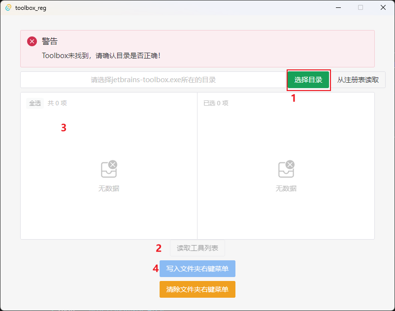
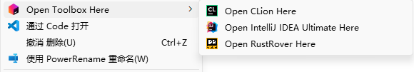
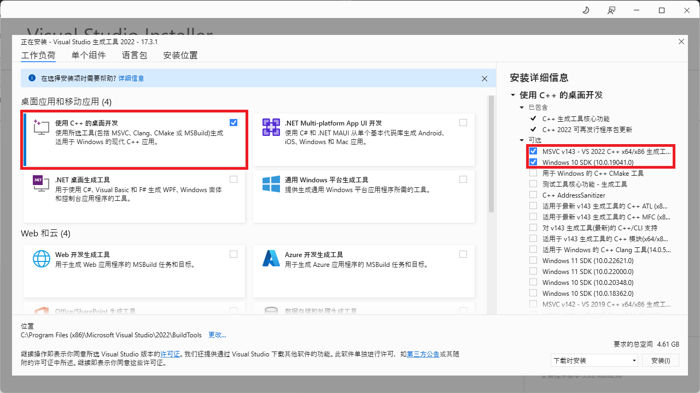

# toolbox_reg

用来生成Jetbrains Toolbox所管理的IDE的右键菜单的，因为它直到现在都只能生成文件的右键菜单关联而不是文件夹的右键菜单关联

只适用于Windows（Only for Windows）

## 使用

请到Release下载最新版本并打开

1. 软件会自动读取toolbox位置，或者手动从界面上方按钮选择目录
2. 点击“读取工具列表”按钮
3. 在穿梭框中选择需要的IDEs
4. 点击“写入文件夹右键菜单”按钮



生成的右键菜单如下所示：


## 开发者指南

### 环境需求

- [Rust](https://www.rust-lang.org/) 1.60+
    - 需要 MSVC 工具链才能完整支持 tauri 功能
        - 可使用`rustup default stable-msvc`命令切换
- [Node.js](https://nodejs.org/en) 18+ / 20+
    - 为了使用 npm 以及支持 vite
- Microsoft Visual Studio C++ 生成工具
    - 您需要安装 Microsoft C++ 生成工具。 最简单的方法是下载 [Visual Studio 2022](https://visualstudio.microsoft.com/visual-cpp-build-tools/) 生成工具。 进行安装选择时，请勾选 "C++ 生成工具" 和 Windows 10 SDK
    
- WebView2
    - Windows 10 版本1803之后以及Windows 11自带
    - 你可以从[微软官网](https://developer.microsoft.com/zh-cn/microsoft-edge/webview2/#download-section)下载安装

### 命令

首先安装依赖
```
npm install
```

运行程序
```
npm run tauri dev
```

构建程序，生成的程序在`src-tauri/target/release/toolbox_reg.exe`
```
npm run tauri build
```
